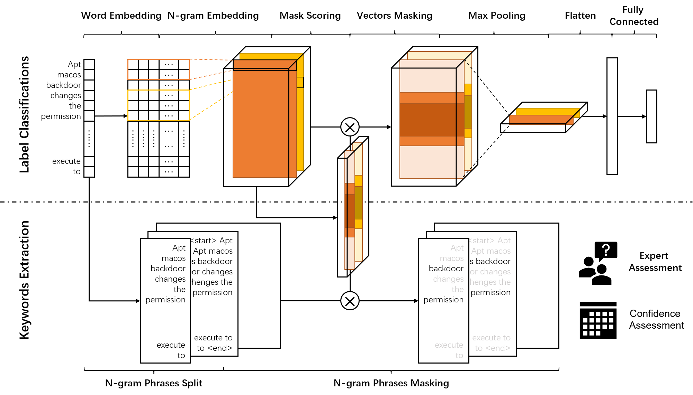

# SeqMask
SeqMask is a [Tensorflow2](https://tensorflow.google.cn/versions) Classification Model for 
TTPs (Tactics, Techniques, and Procedures) in Cyber Threat Intelligence (CTI).
It takes texts (str/list(str)) as the input, and returns the predictions of Tactics and Techniques sentence by sentence.

Moreover, due to its scoring layers, SeqMask can be transformed into a weakly-supervised words importance predict model.



Fig 1. SeqMask model

This is the example program of how to use SeqMask to analyse TTPs. 
Follow the followed steps, you can learn how to use our model to classify even find out the words scores of the inputs.

# Program Dir
- **./FastTextModel**: It is where the words-embedding model for cyber-security saved.
- **./models**: It is the place where the pre-trained SeqMask trained by ourselves kept.
- **DataPreprecess.py**: It the python file for pre-processing texts.
- **DataDeal.py**: It the data deal packet for dealing texts and embedding them into FastText vectors.
- **MaskAttention.py**: It keeps the different Mask Attention Layers.
- **SeqMask.py**: The main Model for SeqMask, which is built by tensorflow2.0. 
- **TextClassify.py**: The packet classification dealing for texts.
- **text.py**: Test for SeqMask.

# How to classify techniques and tactics
User can follow the steps in `test.py` to test SeqMask
```python
from TextClassify import TextDeal

if __name__ == '__main__':
    test = TextDeal()
    text_predict = test.classify_text("PLATINUM has renamed rar.exe to avoid detection.")
    print(text_predict["total_techniques"])
```
Example Input:
```
"PLATINUM has renamed rar.exe to avoid detection."
```
Supposed Results:
```
{'T1001': 1.1920928955078125e-07, 'T1003': 2.9802322387695312e-08, 'T1005': 3.5762786865234375e-07, 'T1007': 0.0, 'T1008': 0.0, 'T1010': 0.0, 'T1012': 0.0, 'T1014': 8.371472358703613e-05, 'T1016': 0.0, 'T1018': 2.9802322387695312e-08, 'T1020': 0.0, 'T1021': 3.5762786865234375e-07, 'T1025': 8.940696716308594e-08, 'T1027': 0.0005973875522613525, 'T1029': 0.0, 'T1030': 0.0, 'T1033': 1.1920928955078125e-07, 'T1036': 0.7139955163002014, 'T1037': 0.0, 'T1039': 1.1920928955078125e-07, 'T1040': 1.7881393432617188e-07, 'T1041': 2.384185791015625e-07, 'T1046': 5.960464477539063e-08, 'T1047': 1.1920928955078125e-07, 'T1048': 4.6193599700927734e-06, 'T1049': 8.07642936706543e-06, 'T1053': 1.1026859283447266e-05, 'T1055': 2.250075340270996e-05, 'T1057': 4.827976226806641e-06, 'T1059': 1.7881393432617188e-07, 'T1068': 2.9802322387695312e-08, 'T1069': 0.0, 'T1070': 3.8295984268188477e-05, 'T1071': 0.0, 'T1072': 1.6391277313232422e-06, 'T1074': 1.3828277587890625e-05, 'T1078': 2.0563602447509766e-06, 'T1080': 2.682209014892578e-07, 'T1082': 5.662441253662109e-07, 'T1083': 1.7881393432617188e-07, 'T1087': 5.960464477539063e-08, 'T1090': 0.0, 'T1091': 7.957220077514648e-06, 'T1092': 1.4901161193847656e-07, 'T1095': 2.086162567138672e-07, 'T1098': 1.4901161193847656e-07, 'T1102': 0.0, 'T1104': 3.069639205932617e-06, 'T1105': 2.2739171981811523e-05, 'T1106': 2.086162567138672e-07, 'T1110': 9.238719940185547e-07, 'T1111': 8.940696716308594e-08, 'T1112': 3.993511199951172e-06, 'T1113': 5.662441253662109e-07, 'T1115': 0.0, 'T1119': 3.4570693969726562e-06, 'T1120': 6.139278411865234e-06, 'T1123': 2.384185791015625e-07, 'T1124': 0.0, 'T1125': 2.384185791015625e-07, 'T1129': 1.7881393432617188e-07, 'T1132': 0.0, 'T1133': 2.682209014892578e-07, 'T1134': 0.0, 'T1135': 0.0, 'T1137': 1.0132789611816406e-06, 'T1140': 2.9802322387695312e-08, 'T1176': 3.8743019104003906e-07, 'T1185': 1.4901161193847656e-07, 'T1187': 0.0, 'T1189': 1.4901161193847656e-07, 'T1190': 1.1920928955078125e-07, 'T1195': 3.039836883544922e-06, 'T1197': 1.58846378326416e-05, 'T1199': 2.175569534301758e-06, 'T1200': 1.4901161193847656e-06, 'T1201': 1.4901161193847656e-07, 'T1202': 4.172325134277344e-07, 'T1203': 5.960464477539063e-08, 'T1205': 1.6093254089355469e-06, 'T1207': 1.817941665649414e-06, 'T1210': 0.0, 'T1211': 1.3530254364013672e-05, 'T1213': 2.086162567138672e-07, 'T1217': 1.1920928955078125e-07, 'T1219': 0.0, 'T1220': 2.2679567337036133e-05, 'T1221': 1.817941665649414e-06, 'T1398': 0.0, 'T1400': 8.940696716308594e-08, 'T1401': 5.960464477539063e-08, 'T1402': 0.0, 'T1404': 0.0, 'T1406': 8.940696716308594e-08, 'T1407': 8.940696716308594e-08, 'T1409': 1.7881393432617188e-07, 'T1410': 2.9802322387695312e-08, 'T1411': 0.0, 'T1412': 0.0, 'T1413': 1.1920928955078125e-07, 'T1414': 8.940696716308594e-08, 'T1417': 0.0, 'T1418': 1.7881393432617188e-07, 'T1420': 0.0, 'T1422': 0.0, 'T1424': 5.960464477539063e-08, 'T1426': 2.9802322387695312e-08, 'T1428': 0.0, 'T1429': 0.0, 'T1430': 2.9802322387695312e-08, 'T1432': 2.9802322387695312e-08, 'T1433': 8.046627044677734e-07, 'T1435': 1.1920928955078125e-07, 'T1436': 0.0, 'T1437': 0.0, 'T1438': 0.0, 'T1444': 0.0, 'T1446': 5.960464477539063e-08, 'T1447': 4.172325134277344e-07, 'T1448': 1.7881393432617188e-07, 'T1452': 2.9802322387695312e-08, 'T1456': 5.960464477539063e-08, 'T1458': 2.9802322387695312e-08, 'T1471': 5.662441253662109e-07, 'T1472': 2.9802322387695312e-08, 'T1474': 5.960464477539063e-08, 'T1475': 5.960464477539063e-08, 'T1476': 2.086162567138672e-07, 'T1477': 0.0, 'T1478': 0.0, 'T1480': 8.344650268554688e-07, 'T1481': 8.940696716308594e-08, 'T1482': 2.7120113372802734e-06, 'T1484': 5.662441253662109e-07, 'T1485': 1.996755599975586e-06, 'T1486': 0.0002333521842956543, 'T1489': 1.4901161193847656e-07, 'T1490': 8.940696716308594e-08, 'T1496': 0.0012157261371612549, 'T1497': 0.0, 'T1498': 8.046627044677734e-07, 'T1499': 1.049041748046875e-05, 'T1507': 1.1920928955078125e-07, 'T1508': 0.0, 'T1509': 8.940696716308594e-08, 'T1512': 0.0, 'T1513': 2.086162567138672e-07, 'T1516': 0.0, 'T1517': 0.0, 'T1518': 0.0, 'T1520': 5.960464477539063e-08, 'T1521': 8.940696716308594e-08, 'T1523': 5.960464477539063e-08, 'T1528': 1.2010335922241211e-05, 'T1529': 2.086162567138672e-07, 'T1531': 5.960464477539063e-08, 'T1532': 1.1920928955078125e-07, 'T1533': 0.0, 'T1534': 2.9802322387695312e-08, 'T1539': 2.9802322387695312e-08, 'T1540': 8.940696716308594e-08, 'T1541': 2.9802322387695312e-08, 'T1543': 1.150369644165039e-05, 'T1544': 0.0, 'T1552': 0.0, 'T1554': 4.902482032775879e-05, 'T1555': 1.4901161193847656e-07, 'T1556': 8.940696716308594e-07, 'T1560': 0.00377047061920166, 'T1566': 6.0498714447021484e-06, 'T1567': 1.1622905731201172e-06, 'T1568': 5.960464477539063e-08, 'T1570': 0.0, 'T1571': 2.294778823852539e-06, 'T1572': 2.682209014892578e-07, 'T1573': 5.364418029785156e-07, 'T1574': 3.874301910400391e-06, 'T1575': 2.9802322387695312e-08, 'T1576': 8.940696716308594e-08, 'T1577': 1.4901161193847656e-07, 'T1579': 2.384185791015625e-07, 'T1581': 0.0, 'T1582': 8.940696716308594e-08, 'T1585': 8.940696716308594e-08}
```

# How to get weakly-supervised important words
By transforming the pre-trained models, you can use the text score layers to scoring the words in texts

```python
from tensorflow.keras.models import Model, load_model
from DataDeal import FastTextDeal

out_model = load_model('./models/techniques_mp_mask_model')
model = Model(out_model.input, out_model.get_layer('mask_scores_0').output)
datadeal = FastTextDeal()
tokens = datadeal.getToken('Input Your Text')
embedding_text = datadeal.getEmbedding('Input Your Text', tokens, max_len=128)
model.predict(embedding_text)
```

Or you may use our packet functions in `TextClassify.py` as in `test.py`:
```python
from TextClassify import TextImportance

if __name__ == '__main__':
    test = TextImportance()
    text_scores = test.score_text("Input Your Text")
    print(text_scores)
```

Example Input:
```
PinchDuke steals credentials from compromised hosts. PinchDuke's credential stealing functionality is believed to be based on the source code of the Pinch credential stealing malware (also known as LdPinch). Credentials targeted by PinchDuke include ones associated with many sources such as The Bat!, Yahoo!, Mail.ru, Passport.Net, Google Talk, and Microsoft Outlook.
```

Supposed Results:
```
[{'text': 'functionality', 'score': 0.008107257, 'percent': 1.0}, {'text': 'pinchduke', 'score': 0.008094459, 'percent': 0.9974551}, {'text': 'pinchduke', 'score': 0.008094459, 'percent': 0.9974551}, {'text': 'pinchduke', 'score': 0.008094459, 'percent': 0.9974551}, {'text': 'compromise', 'score': 0.008076998, 'percent': 0.9939832}, {'text': 'microsoft', 'score': 0.008069868, 'percent': 0.9925654}, {'text': 'ldpinch', 'score': 0.008068567, 'percent': 0.99230665}, {'text': 'credential', 'score': 0.008000064, 'percent': 0.9786851}, {'text': 'credential', 'score': 0.008000064, 'percent': 0.9786851}, {'text': 'credential', 'score': 0.008000064, 'percent': 0.9786851}, {'text': 'credential', 'score': 0.008000064, 'percent': 0.9786851}, {'text': 'outlook', 'score': 0.007990798, 'percent': 0.9768426}, {'text': 'pinch', 'score': 0.007967632, 'percent': 0.9722362}, {'text': 'believe', 'score': 0.007962671, 'percent': 0.9712497}, {'text': 'passport', 'score': 0.007940717, 'percent': 0.96688426}, {'text': 'associate', 'score': 0.007911485, 'percent': 0.9610715}, {'text': 'yahoo', 'score': 0.007843517, 'percent': 0.9475564}, {'text': 'google', 'score': 0.007831035, 'percent': 0.94507444}, {'text': 'include', 'score': 0.007765827, 'percent': 0.93210804}, {'text': 'source', 'score': 0.0077467198, 'percent': 0.9283087}, {'text': 'source', 'score': 0.0077467198, 'percent': 0.9283087}, {'text': 'malware', 'score': 0.007727351, 'percent': 0.9244573}, {'text': 'target', 'score': 0.007603048, 'percent': 0.89974004}, {'text': 'many', 'score': 0.0075933947, 'percent': 0.8978206}, {'text': 'steal', 'score': 0.007446218, 'percent': 0.86855507}, {'text': 'steal', 'score': 0.007446218, 'percent': 0.86855507}, {'text': 'steal', 'score': 0.007446218, 'percent': 0.86855507}, {'text': 'such', 'score': 0.007397862, 'percent': 0.8589399}, {'text': 'host', 'score': 0.0072974353, 'percent': 0.8389703}, {'text': 'also', 'score': 0.007246503, 'percent': 0.8288427}, {'text': 'talk', 'score': 0.0072239535, 'percent': 0.8243589}, {'text': 'and', 'score': 0.00717732, 'percent': 0.8150859}, {'text': 'with', 'score': 0.0071461983, 'percent': 0.80889755}, {'text': 'one', 'score': 0.0071120644, 'percent': 0.8021102}, {'text': 'bat', 'score': 0.007102859, 'percent': 0.8002798}, {'text': 'code', 'score': 0.0070566996, 'percent': 0.79110104}, {'text': 'know', 'score': 0.0070312964, 'percent': 0.78604984}, {'text': 'from', 'score': 0.0070215813, 'percent': 0.78411794}, {'text': 'the', 'score': 0.0069718994, 'percent': 0.77423894}, {'text': 'the', 'score': 0.0069718994, 'percent': 0.77423894}, {'text': 'the', 'score': 0.0069718994, 'percent': 0.77423894}, {'text': 'base', 'score': 0.0068964483, 'percent': 0.7592358}, {'text': 'net', 'score': 0.006874402, 'percent': 0.754852}, {'text': 'mail', 'score': 0.0065475735, 'percent': 0.68986356}, {'text': 'be', 'score': 0.006001576, 'percent': 0.58129424}, {'text': 'of', 'score': 0.0049593723, 'percent': 0.37405655}, {'text': 'to', 'score': 0.0046196026, 'percent': 0.3064948}, {'text': 'ru', 'score': 0.0044729263, 'percent': 0.27732882}, {'text': 'on', 'score': 0.0044092564, 'percent': 0.26466835}, {'text': 'by', 'score': 0.0040679895, 'percent': 0.1968089}, {'text': 'a', 'score': 0.0030782328, 'percent': 0.0}, {'text': 'a', 'score': 0.0030782328, 'percent': 0.0}]
```